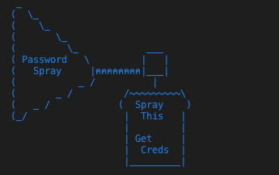

# Spraygen
Password list generator for password spraying - prebaked with goodies

<p align="center">
  
</p>

**Version 1.6**

Generates permutations of Months, Seasons, Years, Sports Teams (NFL, NBA, MLB, NHL), Sports Scores, "Password", and even Iterable Keyspaces of a specified size.

All permutations are generated with common attributes appended/prepended (such as "!" or "#"), or custom separators (such as "." or "_").

Common letter replacement option (change all A -> 4/@ for example)

Users can extend the attributes and separators using comma delimited lists of characters.

Spraygen also accepts single words or external wordlists that allow you to generate tuned custom wordlists in addition to what is already provided.

You could use tools like crunch, a fancy bash loop over SecLists, or whatever have you but that takes time...this one is made for spraying, so get to it!


```
python3 spraygen.py -h
     _
    (  \_
    (    \_
    (       \_  
    (         \_            ___
    ( Password   \         |   |
    (   Spray     |คคคคคคคค|___|
    (           _ /          |
    (       _ /         /~~~~~~~~~\
    (   _ /            (  Spray    )
    (_/                 |  This   |
                        |         |
                        | Get     |
                        |  Creds  |
                        |_________|

    Original Art by Alex Chudnovsky (Unaffiliated)
    Spraygen tool by 3ndG4me
    Version 1.6
    
usage: spraygen.py [-h] [--year_start YEAR_START] [--year_end YEAR_END] [-s separators] [-a attributes] [-w wordlist] [-n single word] [--mode {all,nosep,noattr,years,plain,letter,quick,custom}]
                   [--type {all,iterative,sports,nfl,nba,mlb,nhl,months,seasons,password,common,short,custom} [{all,iterative,sports,nfl,nba,mlb,nhl,months,seasons,password,common,short,custom} ...]]
                   [--iter {ascii,num,spec,asciinum,asciispec,numspec,full}] [--size SIZE] [--min_length MIN_LENGTH] [--max_length MAX_LENGTH] [-o output file] [-p] [--sort {nosort,asc,desc,random}] [-v]

Parse Spray List Arguments.

optional arguments:
  -h, --help            show this help message and exit
  --year_start YEAR_START
                        starting year for a range of years
  --year_end YEAR_END   ending year for a range of years
  -s separators         a comma delimited list of one or more separators
  -a attributes         a comma delimited list of one or more attributes
  -w wordlist           path to a custom wordlist
  -n single word        single custom word to generate a custom wordlist with
  --mode {all,nosep,noattr,years,plain,letter,quick,custom}
                        Mode for list generation. Can be all, no separators, no attributes, only years, plain, letter, quick, or custom (will only use parameters passed into -s or -a).
  --type {all,iterative,sports,nfl,nba,mlb,nhl,months,seasons,password,common,short,custom} [{all,iterative,sports,nfl,nba,mlb,nhl,months,seasons,password,common,short,custom} ...]
                        Type of list to generate. Can be all, iterative, sports, nfl, nba, mlb, nhl, months, seasons, password, common, short, or custom. Choosing 'all' executes all options except for 'iterative' which
                        must be run manually.
  --iter {ascii,num,spec,asciinum,asciispec,numspec,full}
                        Keyspace mode for iterative list generation. Only works when --type is set to 'iterative'. Can be ascii, num, spec, asciinum, asciispec, numspec, or full. Will generate all permutations of the
                        selected keyspace with a given length set with the --size parameter.
  --size SIZE           Length of passwords generated by a set keyspace. Only works when --type is set to 'iterative' and an --iter keyspace mode is set.
  --min_length MIN_LENGTH
                        Minimum length of passwords to include in the list. (Default: 1)
  --max_length MAX_LENGTH
                        Maximum length of passwords to include in the list (Default: 999)
  -o output file        name of a file to create and write the final output to
  -p                    prints the output line by line as plaintext
  --sort {nosort,asc,desc,random}
                        Sort final output. Sorting methods supported are nosort, asc, desc, random.
  -v                    prints the current version of spraygen and exits
  ```

  ## Basic Usage
  1. Install dependencies `pip3 install -r requirements.txt`
  2. Run `python3 spraygen.py -p` - this will generate all default built in wordlists with all permutations and print them to the screen

  ## Usage Recommendations
  - [Usage Docs](docs/usage.md)

  ## Credits
  - [@MarkoH17](https://github.com/MarkoH17) - for the boolean python3.8 backwards compatibility fix
  - [@absolomb](https://github.com/absolomb) - for enhancing type selection and attribute logic in year generation
